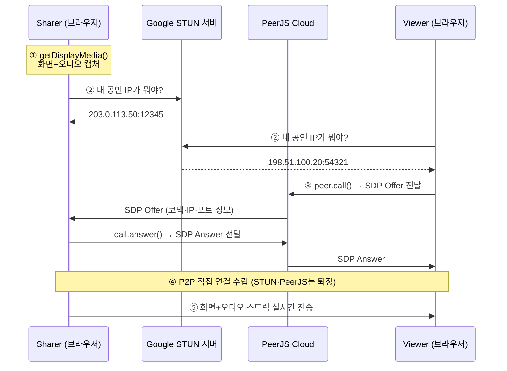

# WebRTC 화면 공유의 핵심 기술

브라우저가 제공하는 API만으로 서버 비용 없이 P2P 화면 공유를 구현하는 원리를 정리한다.



> **한 줄 요약**: 서버(STUN, PeerJS)는 **소개팅 주선자** — 양쪽의 연락처(공인 IP, 코덱 사양)를 전해주고 퇴장한다. 실제 대화(영상/오디오)는 피어끼리 직접 한다.

## 핵심 개념

화면 공유 앱의 기술 스택은 크게 3가지로 나뉜다:

| 계층 | 제공자 | 역할 |
|------|--------|------|
| `getDisplayMedia()` | Chrome/브라우저 | 화면 + 시스템 오디오 캡처 |
| WebRTC 엔진 | Chrome/브라우저 | P2P 미디어 전송, 코덱(VP8, Opus) |
| STUN 서버 | Google (무료) | NAT 통과를 위한 공인 IP 확인 |

**JS 코드가 하는 일**: 위 API들을 호출하고 연결하는 **글루 코드**뿐이다. 자체 오디오/비디오 처리 기술은 없다.

## WebRTC — P2P가 필요한 이유

WebRTC(Web Real-Time Communication)는 Google이 2011년 오픈소스로 공개하고, 2021년 W3C 공식 웹 표준으로 채택된 **브라우저 내장 P2P 통신 엔진**이다.

미디어 전송 방식은 2가지:

### 서버 중계 방식 (Zoom, Google Meet)

```
Sharer → [서버] → Viewer
```

- 영상/소리가 서버를 거침 → **서버 비용 발생** (1080p 1시간 = 수 GB)
- 다수 참가자에 유리 (서버가 중앙에서 분배)

### P2P 직접 전송 (이 프로젝트)

```
Sharer ←──────→ Viewer
     (직접 연결)
```

- 서버를 안 거침 → **비용 0원**
- 서버는 처음 연결 시에만 도움

이 프로젝트의 목표가 "서버 비용 0원"이므로 P2P를 선택했다.

## getDisplayMedia — 화면 캡처

브라우저가 제공하는 화면 캡처 API다.

```javascript
const stream = await navigator.mediaDevices.getDisplayMedia({
  video: true,
  audio: true  // 시스템 오디오 포함
});
```

- `video: true` — 화면(탭, 창, 전체 화면) 캡처
- `audio: true` — 시스템 오디오 캡처 (Chrome 탭 공유 시)
- 사용자가 직접 공유 대상을 선택하는 UI는 브라우저가 제공

## STUN과 NAT 통과

### 문제: 사설 IP

대부분의 컴퓨터는 공유기(라우터) 뒤에 있어 **사설 IP** (192.168.x.x)를 사용한다. 외부에서 직접 접속이 불가능하다.

### STUN 서버의 역할

STUN(Session Traversal Utilities for NAT) 서버는 "너의 공인 IP와 포트가 뭔지" 알려주는 서버다.

```
[내 PC: 192.168.0.5]
       │
       │ "내 공인 IP가 뭐야?"
       ▼
[공유기/NAT: 공인 IP 203.0.113.50]
       │
       ▼
[STUN 서버 (Google)]
       │
       │ "너는 203.0.113.50:12345 로 보인다"
       ▼
[내 PC: 이제 상대에게 이 주소를 알려줌]
```

주소만 알려주고 빠지기 때문에 **무료**이고 부하가 거의 없다.

```javascript
// 출처: zoomlike 프로젝트
const peer = new Peer({
  config: {
    iceServers: [
      { urls: 'stun:stun.l.google.com:19302' },
      { urls: 'stun:stun1.l.google.com:19302' }
    ]
  }
});
```

## SDP — 연결 협상 프로토콜

SDP(Session Description Protocol)는 **"나 이런 사양으로 통신할 수 있어"** 라는 자기소개서다.

### 담고 있는 정보

- 내 IP/포트 (STUN으로 알아낸 공인 주소)
- 지원하는 코덱 (VP8, H.264, Opus 등)
- 미디어 종류 (비디오 있음, 오디오 있음)
- 암호화 키 (DTLS fingerprint)

### 교환 과정 (Offer/Answer)

```
Sharer                    PeerJS 서버                  Viewer
  │  ── SDP Offer ──────→ │ ── SDP Offer ─────────→  │
  │     "나 VP8/Opus 가능, │                          │
  │      IP는 203.0.113.50"│                          │
  │                        │                          │
  │  ←── SDP Answer ───── │ ←── SDP Answer ────────  │
  │                        │    "나도 VP8/Opus OK,    │
  │                        │     IP는 198.51.100.20"  │
  │                        │                          │
  │  ←──────── P2P 직접 연결 ─────────────→           │
```

PeerJS가 SDP 교환을 자동 처리하므로 코드에서 직접 다룰 필요는 없다. `peer.call()` → SDP Offer 자동 생성, `call.answer()` → SDP Answer 자동 생성.

## PeerJS — WebRTC 래퍼 라이브러리

PeerJS는 Google이 아닌 **오픈소스 커뮤니티 프로젝트**다.

| | WebRTC (브라우저 내장) | PeerJS |
|---|---|---|
| 만든 곳 | Google/W3C | 개인 개발자들 |
| 역할 | P2P 미디어 전송 엔진 | WebRTC를 쉽게 쓰게 해주는 래퍼 |

WebRTC를 직접 쓰면 SDP 생성, ICE candidate 교환 등을 수동으로 코딩해야 한다. PeerJS가 이걸 한 줄로 줄여준다.

별도 서버 주소를 지정하지 않으면 **PeerJS 클라우드(`0.peerjs.com`)**를 자동 사용한다.

```
[Google STUN]                → 공인 IP 알려주는 역할 (1회)
[PeerJS Cloud 0.peerjs.com]  → 양쪽 주소(SDP) 교환 역할 (1회)
[P2P 직접 연결]               → 실제 영상/소리 전송 (계속)
```

## 빈 오디오 트랙 트릭

### 문제

Viewer가 `peer.call()`할 때 오디오 트랙 없이 호출하면:

```
Viewer SDP:  비디오 ✅  오디오 ❌
→ Sharer: "오디오 채널 안 열어도 되겠네"
→ 시스템 소리 전송 안 됨!
```

### 해결

무음 오디오 트랙을 코드로 즉석 생성하여 SDP에 "오디오 있음"을 표시한다:

```javascript
// 출처: zoomlike/js/viewer.js
const audioCtx = new AudioContext();
const dest = audioCtx.createMediaStreamDestination();
const audioTrack = dest.stream.getAudioTracks()[0]; // 무음 트랙
stream.addTrack(audioTrack);
```

mp3 같은 파일이 아니라 메모리에만 존재하는 **무음 신호 객체**다. 빈 봉투를 넣어서 오디오 채널을 열어두는 트릭이다.

## 다중 Viewer와 P2P 한계

### P2P 대역폭 부담

P2P에서는 Sharer가 **같은 영상을 viewer 수만큼 따로** 보낸다:

```
1명:  ~3 Mbps 업로드
2명:  ~6 Mbps
3명:  ~9 Mbps
10명: ~30 Mbps + CPU 과부하 + 공유기 불안정
```

일반 가정 인터넷(업로드 50~100 Mbps) 기준 **2~3명은 문제없고, 현실적 한계는 3~4명**이다. 그 이상은 서버 중계(SFU) 방식이 필요하다.

### 연결 배열 관리

다중 Viewer를 안정적으로 관리하려면 연결을 배열로 관리해야 한다. 단일 변수(`currentCall`)만 쓰면 마지막 Viewer만 정상 종료되고 나머지는 **화면이 멈춘 채 방치**되는 UX 문제가 생긴다.

## 핵심 정리

> 화면 공유 앱의 JS 코드는 브라우저 내장 API를 호출하는 글루 코드다.
> 화면 캡처(getDisplayMedia), 미디어 전송(WebRTC), NAT 통과(STUN), 연결 협상(SDP)은 모두 브라우저가 제공하며,
> PeerJS가 복잡한 WebRTC 절차를 래핑해주어 `peer.call()` 한 줄로 P2P 화면 공유가 가능하다.
> P2P는 서버 비용 0원이지만 Viewer 수가 늘면 Sharer 부담이 선형 증가하므로 소규모(3~4명)에 적합하다.
